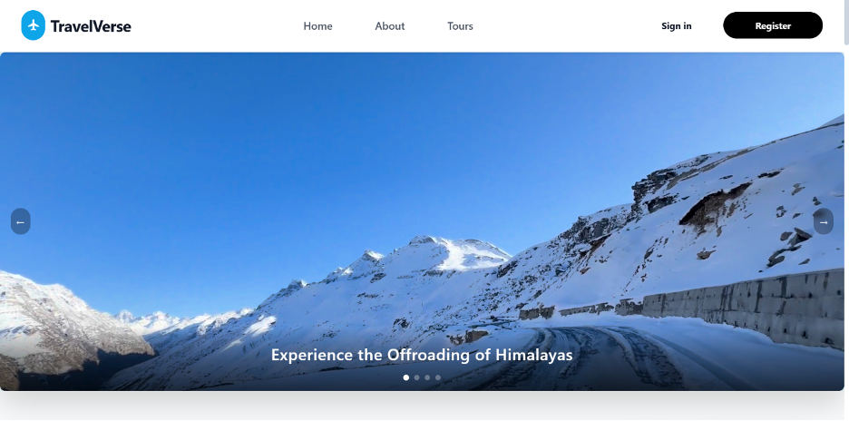
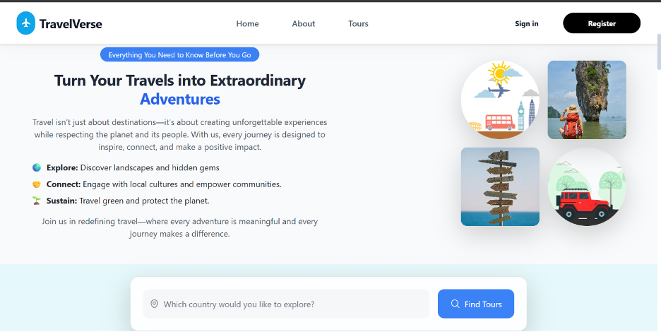
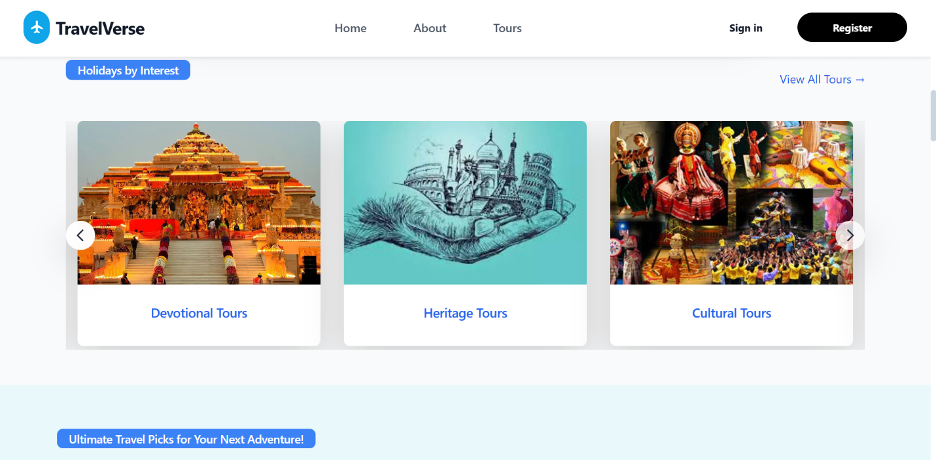
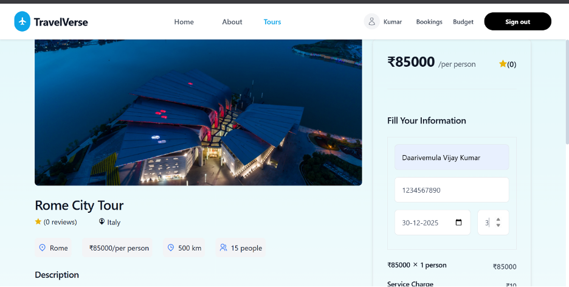
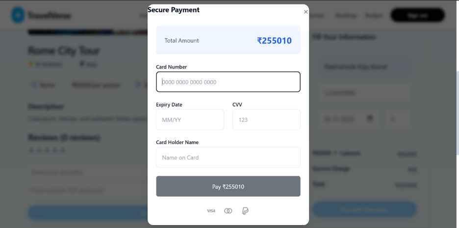

# TravelVerse 🌍🗺️

[](https://mern.dev)
[](https://jwt.io)

A full-featured travel platform offering secure bookings, personalized experiences, and comprehensive tour management.


## 🔥 Key Features

### **Authentication & Security**
- 🔐 **JWT-based User Authentication**
- 🌐 **Google OAuth 2.0 Integration**
- ✉️ **Email Verification System**
- 🔄 **Password Reset & Recovery**
- 🛡️ **Role-Based Authorization** (User/Admin)

### **User Experience**
- 🌓 **Dark/Light Theme Toggle**
- 🎯 **Personalized Tour Recommendations**
- 🔍 **Advanced Search Filters**:
  - Country/Region
  - Price Range
  - Duration
  - Interest Tags (Adventure, Cultural, etc.)
  - Rating Threshold
- ⭐ **Interactive Rating & Review System**
- 📅 **Real-Time Availability Calendar**

### **Booking System**
- 💳 **Secure Payment Integration** (Stripe/Razorpay)
- 📧 **Booking Confirmation Emails**
- 📦 **Booking History & Management**
- 🚨 **Last-Minute Deal Alerts**

### **Tour Management**
- 📸 **Rich Tour Details** with 360° Virtual Tours
- 📍 **Interactive Location Maps** (Google Maps API)
- 📊 **Tour Analytics Dashboard**
- 📝 **Dynamic Itinerary Planner**

## 🛠 Tech Stack

### **Frontend**
- React.js
- Redux Toolkit for State Management
- React Router v6
- Framer Motion
- Tailwind CSS + Flowbite + Bootstrap


### **Backend**
- Node.js & Express.js
- MongoDB + Mongoose
- JSON Web Tokens (JWT)
- Passport.js (Google OAuth)
- Nodemailer (Email Service)


### **Services**

- MongoDB Atlas (Cloud Database)
- Render/Vercel (Cloud Hosting)

### **Advanced Search Architecture**

Elasticsearch-powered Query Engine

GeoJSON-based Location Filtering

Tag-based Recommendation System

Cached Search Results

Review System
5-Star Rating with Half-Star Support

Verified Purchaser Reviews

Admin Moderation Panel

Review Analytics Dashboard

## **📸 Feature Showcase **

**1. Homepage**






**2. tour details and booking**




## 🚀 Getting Started

Follow these steps to set up the project locally on your machine.

### Prerequisites

- **Node.js** v18+
- **MongoDB** (Local or Atlas)
- **Google Cloud Console Account** (for OAuth)

### Installation

#### 1. Clone the Repository

```bash
git clone https://github.com/reallymanya/PackYourBags
cd Travel_Verse_MERN
```

#### 2. Backend Setup

Navigate to the backend directory and install dependencies:

```bash
cd backend
npm install
```

Create a `.env` file in the `backend` directory with the following variables:

```env
PORT=4000
MONGO_URI=your_mongodb_connection_string
JWT_SECRET_KEY=your_jwt_secret_key
GOOGLE_CLIENT_ID=your_google_client_id
EMAIL_USER=your_email_address_for_nodemailer
EMAIL_PASS=your_email_app_password
```


Start the backend server:

```bash
npm run dev
```

#### 3. Database Seeding (Crucial for new features)

To populate the database with the latest tours (including localized pricing and new categories) and initialize the subscription system, run the following command in the `backend` directory:

```bash
node seedMoreTours.js
```

This script will:
- Clear existing tours
- Insert updated tour data (Indian prices, images, categories)
- Initialize necessary collections

#### 4. Frontend Setup

Open a new terminal, navigate to the frontend directory and install dependencies:

```bash
cd ../frontend
npm install
```

Create a `.env` file in the `frontend` directory:

```env
REACT_APP_GOOGLE_CLIENT_ID=your_google_client_id
```

Start the frontend application:

```bash
npm start
```
